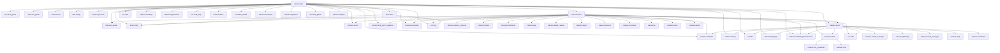

```mermaid
graph TD
    src_server_main["server.main"]
    src_sim_save_save_game["sim.save_game"]
    src_server_main --> src_sim_save_save_game
    src_classes_calendar["classes.calendar"]
    src_server_main --> src_classes_calendar
    src_classes_history["classes.history"]
    src_server_main --> src_classes_history
    src_sim_load_load_game["sim.load_game"]
    src_server_main --> src_sim_load_load_game
    src_classes_sect["classes.sect"]
    src_server_main --> src_classes_sect
    src_utils_llm_config["utils.config"]
    src_server_main --> src_utils_llm_config
    src_sim_new_avatar["sim.new_avatar"]
    src_server_main --> src_sim_new_avatar
    src_classes_persona["classes.persona"]
    src_server_main --> src_classes_persona
    src_utils_config["utils.config"]
    src_server_main --> src_utils_config
    src_sim_simulator["sim.simulator"]
    src_server_main --> src_sim_simulator
    src_utils_llm_client["utils.client"]
    src_server_main --> src_utils_llm_client
    src_utils["src.utils"]
    src_server_main --> src_utils
    src_classes_auxiliary["classes.auxiliary"]
    src_server_main --> src_classes_auxiliary
    src_classes_appearance["classes.appearance"]
    src_server_main --> src_classes_appearance
    src_run_load_map["run.load_map"]
    src_server_main --> src_run_load_map
    src_classes_event["classes.event"]
    src_server_main --> src_classes_event
    src_classes_world["classes.world"]
    src_server_main --> src_classes_world
    src_classes_long_term_objective["classes.long_term_objective"]
    src_server_main --> src_classes_long_term_objective
    src_utils_df["utils.df"]
    src_server_main --> src_utils_df
    src_classes_effect["classes.effect"]
    src_server_main --> src_classes_effect
    src_classes_language["classes.language"]
    src_server_main --> src_classes_language
    src_classes_celestial_phenomenon["classes.celestial_phenomenon"]
    src_server_main --> src_classes_celestial_phenomenon
    src_classes_cultivation["classes.cultivation"]
    src_server_main --> src_classes_cultivation
    src_run_data_loader["run.data_loader"]
    src_server_main --> src_run_data_loader
    src_classes_technique["classes.technique"]
    src_server_main --> src_classes_technique
    src_classes_alignment["classes.alignment"]
    src_server_main --> src_classes_alignment
    src_run_log["run.log"]
    src_server_main --> src_run_log
    src_sim_load_game["sim.load_game"]
    src_server_main --> src_sim_load_game
    src_classes_weapon["classes.weapon"]
    src_server_main --> src_classes_weapon
    src_classes_avatar["classes.avatar"]
    src_classes_avatar_info_presenter["classes.info_presenter"]
    src_classes_avatar --> src_classes_avatar_info_presenter
    src_classes_avatar_core["classes.core"]
    src_classes_avatar --> src_classes_avatar_core
    src_sim_simulator["sim.simulator"]
    src_sim_simulator --> src_classes_calendar
    src_classes_relation_resolver["classes.relation_resolver"]
    src_sim_simulator --> src_classes_relation_resolver
    src_classes_fortune["classes.fortune"]
    src_sim_simulator --> src_classes_fortune
    src_i18n["src.i18n"]
    src_sim_simulator --> src_i18n
    src_sim_simulator --> src_sim_new_avatar
    src_classes_misfortune["classes.misfortune"]
    src_sim_simulator --> src_classes_misfortune
    src_classes_age["classes.age"]
    src_sim_simulator --> src_classes_age
    src_classes_death_reason["classes.death_reason"]
    src_sim_simulator --> src_classes_death_reason
    src_classes_region["classes.region"]
    src_sim_simulator --> src_classes_region
    src_sim_simulator --> src_utils_config
    src_sim_simulator --> src_classes_world
    src_sim_simulator --> src_classes_event
    src_sim_simulator --> src_classes_long_term_objective
    src_classes_observe["classes.observe"]
    src_sim_simulator --> src_classes_observe
    src_classes_nickname["classes.nickname"]
    src_sim_simulator --> src_classes_nickname
    src_sim_simulator --> src_classes_celestial_phenomenon
    src_sim_simulator --> src_classes_cultivation
    src_sim_simulator --> src_classes_avatar
    src_classes_ai["classes.ai"]
    src_sim_simulator --> src_classes_ai
    src_sim_simulator --> src_run_log
    src_classes_name["classes.name"]
    src_sim_simulator --> src_classes_name
    src_classes_death["classes.death"]
    src_sim_simulator --> src_classes_death
    src_utils_llm_client["utils.client"]
    src_utils_llm_client --> src_run_log
    src_utils_llm_client --> src_utils_config
    src_classes_world["classes.world"]
    src_classes_avatar_manager["classes.avatar_manager"]
    src_classes_world --> src_classes_avatar_manager
    src_classes_world --> src_classes_avatar
    src_classes_world --> src_classes_calendar
    src_classes_world --> src_classes_history
    src_classes_gathering_gathering["classes.gathering"]
    src_classes_world --> src_classes_gathering_gathering
    src_classes_world --> src_utils_df
    src_classes_event_manager["classes.event_manager"]
    src_classes_world --> src_classes_event_manager
    src_classes_world --> src_classes_language
    src_classes_world --> src_i18n
    src_classes_world --> src_classes_celestial_phenomenon
    src_classes_map["classes.map"]
    src_classes_world --> src_classes_map
    src_classes_circulation["classes.circulation"]
    src_classes_world --> src_classes_circulation
```