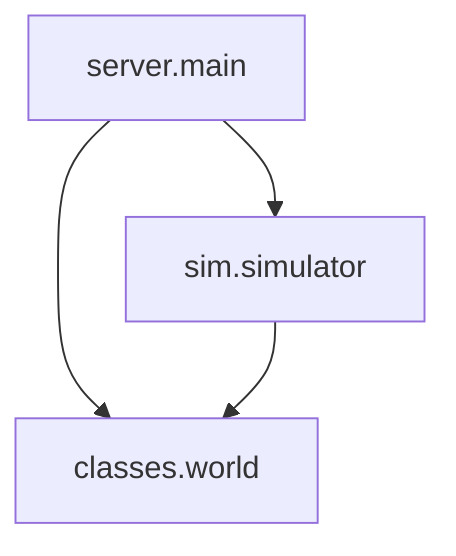

# AI 开发助手工具使用指南

## 概述

`ai_dev_assistant.py` 是为 AI 开发者设计的项目分析工具，提供依赖分析、API 提取、测试覆盖率检查等功能，帮助快速理解项目结构和生成开发文档。

## 功能列表

| 功能 | 命令 | 说明 |
|------|------|------|
| 依赖分析 | `deps` | 生成模块依赖图，检测循环依赖 |
| API 提取 | `api-list` | 提取所有 API 端点 |
| 影响分析 | `impact` | 分析代码变更的影响范围 |
| 测试覆盖率 | `test-coverage` | 生成测试覆盖率报告 |
| 文档检查 | `doc-check` | 检查文档完整性 |
| 上手指南 | `onboarding` | 生成新人上手指南 |

## 安装

无需额外安装，工具只依赖 Python 标准库。

```bash
# 确保在项目根目录
cd cultivation-world-simulator

# 查看帮助
python tools/ai_dev_assistant.py --help
```

## 使用示例

### 1. 生成模块依赖图

**生成 Mermaid 格式的依赖图**（适合嵌入 Markdown 文档）：

```bash
python tools/ai_dev_assistant.py deps --format mermaid --output docs/MODULE_MAP.md
```

**生成 JSON 格式的依赖图**（适合程序化处理）：

```bash
python tools/ai_dev_assistant.py deps --format json --output docs/dependencies.json
```

**特性**：
- 自动检测循环依赖并警告
- 只显示核心模块，避免图表过于复杂
- 支持 Mermaid 可视化

**输出示例**：



### 2. 提取所有 API 端点

**生成 JSON 格式的 API 清单**：

```bash
python tools/ai_dev_assistant.py api-list --format json --output docs/api-endpoints.json
```

**生成 Markdown 格式的 API 文档**：

```bash
python tools/ai_dev_assistant.py api-list --format markdown --output docs/API_LIST.md
```

**特性**：
- 自动解析 FastAPI 装饰器
- 提取 HTTP 方法、路径、函数名
- 包含 docstring 说明

**输出示例（JSON）**：

```json
[
  {
    "path": "/api/state",
    "method": "GET",
    "function": "get_state",
    "line": 788,
    "description": "获取当前世界的一个快照（调试模式）"
  },
  {
    "path": "/api/events",
    "method": "GET",
    "function": "get_events",
    "line": 864,
    "description": "分页获取事件列表。"
  }
]
```

### 3. 分析代码变更影响

当你修改了某个文件，想知道会影响哪些模块：

```bash
python tools/ai_dev_assistant.py impact --file src/classes/avatar/core.py
```

**输出示例**：

```
正在分析模块依赖...
分析依赖: [████████████████████████████████████████] 100.0% (245/245)

文件 src/classes/avatar/core.py 的变更会影响以下 23 个模块:
  - src.classes.avatar.core
  - src.classes.avatar_manager
  - src.sim.simulator
  - src.server.main
  - src.classes.ai
  - ...
```

**用途**：
- 评估修改的影响范围
- 确定需要重新测试的模块
- 了解模块间的耦合度

### 4. 生成测试覆盖率报告

检查哪些模块缺少测试文件：

```bash
python tools/ai_dev_assistant.py test-coverage --output docs/TEST_COVERAGE.md
```

**特性**：
- 自动匹配源文件和测试文件
- 计算覆盖率百分比
- 列出所有缺少测试的模块

**输出示例**：

```markdown
# 测试覆盖率报告

**总计**: 127 个模块
**已覆盖**: 68 个 (53.5%)
**未覆盖**: 59 个

## 缺少测试的模块

- `classes/action/move_helper.py`
- `classes/avatar/info_presenter.py`
- `utils/config.py`
- ...
```

### 5. 检查文档完整性

检查代码中的文档缺失情况：

```bash
python tools/ai_dev_assistant.py doc-check --output docs/DOC_STATUS.md
```

**检查项目**：
- 模块 docstring
- 类 docstring
- 函数 docstring
- 函数类型注解

**输出示例**：

```markdown
# 文档完整性检查报告

## 统计

- 总文件数: 245
- 有模块 docstring: 156 (63.7%)
- 缺少 docstring 的类: 42
- 缺少 docstring 的函数: 138

## 详细报告

### `src/classes/action/move.py`

- 缺少模块 docstring
- 3 个类缺少 docstring
- 8 个函数缺少 docstring
```

### 6. 生成新人上手指南

为新加入的开发者生成项目导航：

```bash
python tools/ai_dev_assistant.py onboarding --output docs/ONBOARDING.md
```

**特性**：
- 列出核心文件及其重要性
- 提供学习路径建议
- 包含常见开发任务示例

**输出包含**：
- 项目概览
- 核心文件列表（按重要性排序）
- 7 天学习路径
- 常见开发任务
- 开发工具推荐

## 高级用法

### 在 CI/CD 中使用

在 GitHub Actions 或其他 CI 流程中自动生成文档：

```yaml
- name: Generate API Documentation
  run: |
    python tools/ai_dev_assistant.py api-list --format markdown --output docs/API_LIST.md
    python tools/ai_dev_assistant.py deps --format mermaid --output docs/MODULE_MAP.md

- name: Check Test Coverage
  run: |
    python tools/ai_dev_assistant.py test-coverage --output coverage-report.md
    # 如果覆盖率低于 50%，可以设置失败
```

### 结合其他工具

```bash
# 先生成依赖图，再用其他工具可视化
python tools/ai_dev_assistant.py deps --format json > deps.json
python tools/visualize_deps.py deps.json  # 假设有这样的工具

# 提取 API 后自动生成 Postman Collection
python tools/ai_dev_assistant.py api-list --format json > api.json
python tools/generate_postman.py api.json
```

### 监控变更影响

在 pre-commit hook 中使用：

```bash
#!/bin/bash
# .git/hooks/pre-commit

CHANGED_FILES=$(git diff --cached --name-only --diff-filter=ACM | grep '\.py$')

for FILE in $CHANGED_FILES; do
    echo "Analyzing impact of $FILE..."
    python tools/ai_dev_assistant.py impact --file "$FILE"
done
```

## 工具库 API

如果你想在自己的脚本中使用工具库：

```python
from pathlib import Path
from tools.lib.ast_utils import extract_class_names, extract_imports
from tools.lib.file_utils import find_python_files

# 查找所有 Python 文件
files = find_python_files(Path('src'))

# 提取类名
for file in files:
    classes = extract_class_names(file)
    print(f"{file}: {classes}")

# 提取导入
imports = extract_imports(Path('src/server/main.py'))
print(imports)
```

**可用函数**：

- `ast_utils.py`:
  - `extract_class_names()` - 提取类名
  - `extract_function_names()` - 提取函数名
  - `extract_imports()` - 提取导入语句
  - `has_docstring()` - 检查是否有文档字符串
  - `get_type_hints_coverage()` - 获取类型注解覆盖率
  - `find_function_complexity()` - 计算函数复杂度

- `file_utils.py`:
  - `find_python_files()` - 查找 Python 文件
  - `get_module_name()` - 获取模块名
  - `read_file_safely()` - 安全读取文件
  - `get_file_stats()` - 获取文件统计
  - `ensure_directory()` - 确保目录存在

## 性能说明

- **依赖分析**: 约 245 个文件需要 2-3 秒
- **API 提取**: 单文件分析，通常 < 1 秒
- **测试覆盖率**: 约 245 个文件需要 1-2 秒
- **文档检查**: 约 245 个文件需要 3-5 秒（需要解析 AST）

## 常见问题

### Q: 为什么依赖图只显示部分模块？

A: 为了保持图表可读性，默认只显示核心模块。你可以修改 `DependencyAnalyzer.generate_mermaid()` 中的 `core_modules` 集合来自定义。

### Q: API 提取不完整怎么办？

A: 工具只支持标准的 FastAPI 装饰器语法。如果使用了复杂的路由注册方式，可能无法识别。

### Q: 如何自定义测试文件匹配规则？

A: 修改 `TestCoverageChecker.check_coverage()` 中的 `possible_test_files` 列表。

### Q: 工具报错怎么办？

A: 工具设计为容错的，会跳过无法解析的文件。如果遇到问题，请提交 Issue 并附上完整错误信息。

## 开发与贡献

### 添加新功能

1. 在 `ai_dev_assistant.py` 中添加新的子命令
2. 实现对应的分析器类
3. 在 `main()` 函数中添加命令处理逻辑
4. 更新本文档

### 添加新的分析器

```python
class MyAnalyzer:
    """新的分析器"""

    def __init__(self, project_root: Path):
        self.project_root = project_root

    def analyze(self) -> Any:
        """执行分析"""
        # 你的分析逻辑
        pass

    def generate_report(self, data: Any) -> str:
        """生成报告"""
        # 生成 Markdown 或 JSON
        pass
```

### 运行测试

```bash
# 测试所有命令
python tools/ai_dev_assistant.py deps
python tools/ai_dev_assistant.py api-list
python tools/ai_dev_assistant.py impact --file src/server/main.py
python tools/ai_dev_assistant.py test-coverage
python tools/ai_dev_assistant.py doc-check
python tools/ai_dev_assistant.py onboarding
```

## 相关工具

- `tools/generate_api.py` - API 文档生成器
- `tools/generate_action.py` - 动作代码生成器
- `tools/generate_component.py` - 组件代码生成器

## 更新日志

### v1.0.0 (2026-02-01)

- 初始版本
- 支持依赖分析、API 提取、影响分析
- 支持测试覆盖率检查、文档检查
- 支持生成新人上手指南

## 许可证

MIT License - 与项目主体一致

## 联系方式

- GitHub Issues: https://github.com/AI-Cultivation/cultivation-world-simulator/issues
- 邮件: [项目维护者邮箱]

---

**Happy Coding!** 🚀
